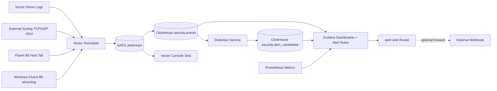
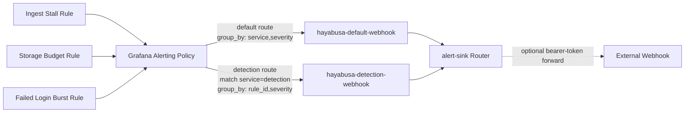

# Hayabusa Security Telemetry Platform (MVP Scaffold)

This repository is a self-hosted, mostly offline, FOSS-first starter scaffold for a modular security telemetry platform intended as an alternative to Wazuh.

## Goals

- Self-hosted
- Mostly offline
- FOSS-first
- Docker Compose first
- Cluster-ready later
- YAML as the source of truth for human-authored config
- One service per container
- Clear separation between infrastructure, ingestion, storage, detection, alerting, and UI

## Initial chosen stack

- ClickHouse
- ClickHouse Keeper
- NATS JetStream
- Vector
- Grafana
- Prometheus

## Local MVP data flow


Active ingest path is now `Vector -> NATS JetStream -> ClickHouse`, with ClickHouse Keeper preserved for future clustering.

## Current MVP status

- Foundation services are defined and runnable in Docker Compose
- Vector normalization is implemented with a demo event source
- ClickHouse database/table ingest path is configured through JetStream
- Prometheus scraping and Grafana datasource provisioning are in place
- SQL-first detection engine MVP writes triggered candidates to `security.alert_candidates`
- JetStream stream bootstrap is automated (`HAYABUSA_EVENTS` + `VECTOR_CLICKHOUSE_WRITER`)
- Fluent Bit host collector baseline is active (`forward -> Vector:24224`)
- Windows event collector template is defined (`winevtlog -> forward -> Vector:24225`)
- Windows endpoint lane is mTLS-enabled in active stack path (Vector + Fluent Bit local collector)
- Windows endpoint hardening toolkit is included (mTLS templates + cert generation + enrollment script)

## Operating hygiene

- Current platform snapshot and restart context: `STATUS.md`
- Feature completion policy: `docs/delivery-hygiene.md`
- Component progress tracker: `docs/component-checklist.md`
- Detection engine details: `docs/detection-engine.md`
- Alert routing details: `docs/alert-routing.md`
- Windows collection runbook: `docs/windows-event-collection.md`
- Investigation queries: `docs/investigation-query-pack.md`

## Repository layout

```text
.
├── configs/
│   ├── environments/
│   ├── global/
│   ├── clickhouse/
│   ├── fluent-bit/
│   ├── grafana/
│   ├── prometheus/
│   ├── rules/
│   └── vector/
├── data/
├── docs/
├── scripts/
├── services/
├── AGENTS.md
├── docker-compose.yml
└── README.md
```

## Quick start

1. Review `AGENTS.md` and `docs/architecture.md`.
2. Start the local stack:

```bash
./scripts/bootstrap.sh
```

3. Validate each component:
- run `./scripts/smoke-test.sh`

4. Open:
- Grafana: `http://localhost:3000`
- Prometheus: `http://localhost:9090`
- ClickHouse HTTP: `http://localhost:8123`
- NATS monitoring: `http://localhost:8222`
- Vector API: `http://localhost:8686`
- Alert router (local webhook endpoint): `http://localhost:5678`
- Grafana dashboard: `Dashboards -> Hayabusa -> Hayabusa Overview`
- Grafana investigation dashboard: `Dashboards -> Hayabusa -> Hayabusa Investigations`
- Grafana alert rule: `Alerting -> Alert rules -> Hayabusa Ingest Stalled`
- Grafana storage alert rule: `Alerting -> Alert rules -> Hayabusa Events Storage Near Budget`
- Grafana detection alert rule: `Alerting -> Alert rules -> Hayabusa Security Failed Login Burst`
- Grafana correlation alert rules:
  - `Hayabusa Windows Failed Logon Followed by Lockout`
  - `Hayabusa Windows Failed Logon Followed by Service Install`
  - `Hayabusa Windows Failed Logon Followed by Group Change`
  - `Hayabusa Windows Lockout Followed by Service Install`

## External syslog feed

Vector accepts external syslog on port `1514` over both TCP and UDP:
- `127.0.0.1:1514/tcp`
- `127.0.0.1:1514/udp`

Example send from host (works on macOS and Linux) with `nc`:

```bash
# UDP
printf '<134>1 2026-03-27T12:00:00Z localtest hayabusa 1001 ID47 - hayabusa external syslog udp test\n' \
  | nc -u -w1 127.0.0.1 1514

# TCP
printf '<134>1 2026-03-27T12:00:00Z localtest hayabusa 1002 ID48 - hayabusa external syslog tcp test\n' \
  | nc -w1 127.0.0.1 1514
```

View live normalized traffic:

```bash
docker compose logs -f vector
```

View Fluent Bit collector logs:

```bash
docker compose logs -f fluent-bit
```

Check JetStream stream + consumer status:

```bash
docker compose run --rm --no-deps nats-init \
  nats --server nats://nats:4222 stream info HAYABUSA_EVENTS
docker compose run --rm --no-deps nats-init \
  nats --server nats://nats:4222 consumer info HAYABUSA_EVENTS VECTOR_CLICKHOUSE_WRITER
```

Query stored events in ClickHouse:

```bash
curl -s http://localhost:8123 --data-binary \
  "SELECT ts, ingest_source, message FROM security.events ORDER BY ts DESC LIMIT 20 FORMAT PrettyCompact"
```

Query latest detection candidates:

```bash
curl -s http://localhost:8123 --data-binary \
  "SELECT ts, rule_id, severity, hits FROM security.alert_candidates ORDER BY ts DESC LIMIT 20 FORMAT PrettyCompact"
```

View detection service logs:

```bash
docker compose logs -f detection
```

View routed alert webhook payloads:

```bash
docker compose logs -f alert-sink
```

Alert routing behavior:



Configure optional external webhook forwarding (local `.env`, not committed):

```bash
HAYABUSA_EXTERNAL_WEBHOOK_URL=https://example-alert-endpoint.local/webhook
HAYABUSA_EXTERNAL_WEBHOOK_TOKEN=replace_me
# Optional:
# HAYABUSA_EXTERNAL_WEBHOOK_TOKEN_FILE=/run/secrets/hayabusa_external_webhook_token
```

Send synthetic failed-login events (to validate `security_failed_login_burst`):

```bash
for i in 1 2 3 4; do
  printf '<134>1 2026-03-28T00:00:00Z authhost sshd 100%d ID47 - Failed password for invalid user root from 10.0.0.%d port 22 ssh2\n' "$i" "$i" \
    | nc -u -w1 127.0.0.1 1514
done
```

## Fluent Bit host collector feed

Fluent Bit tails local files in `data/host-logs` and forwards records to Vector over `forward` protocol.

Generate synthetic host auth lines:

```bash
./scripts/generate-host-logs.sh
```

Query recent Fluent-ingested events:

```bash
curl -s http://localhost:8123 --data-binary \
  "SELECT ts, ingest_source, message FROM security.events WHERE ingest_source = 'vector-fluent' ORDER BY ts DESC LIMIT 20 FORMAT PrettyCompact"
```

## Windows event collection path

Use the template at `configs/fluent-bit/windows/fluent-bit-windows.conf` on Windows endpoints and follow:

- `docs/windows-event-collection.md`
- `./scripts/windows-endpoint-check.sh`
- `./scripts/windows-real-host-cutover-check.sh`

mTLS hardening prep:

```bash
./scripts/generate-windows-forward-certs.sh
./scripts/enroll-windows-endpoint.sh --endpoint-id WIN-ENDPOINT-01 --vector-host 192.168.1.50
```

Note: `./scripts/bootstrap.sh` auto-generates local Windows lane certs in `secrets/windows-forward-tls` when missing.

Local simulator validation (no Windows host required):

```bash
./scripts/generate-windows-events.sh
./scripts/windows-endpoint-check.sh
```

Real-host cutover validation (endpoint-specific + CIDR hardening):

```bash
./scripts/windows-real-host-cutover-check.sh --computer WIN-ENDPOINT-01 --expected-cidr 192.168.10.22/32
```

Trigger Windows EventID detection scenarios:

```bash
./scripts/generate-windows-security-scenarios.sh
curl -s http://localhost:8123 --data-binary \
  "SELECT ts, rule_id, severity, hits FROM security.alert_candidates WHERE rule_id LIKE 'windows_%' ORDER BY ts DESC LIMIT 20 FORMAT PrettyCompact"
```

## Storage budget guardrail (1 GiB)

The local MVP uses a 1 GiB budget target for `security.events` to keep synthetic test traffic bounded.
Default TTL for new deployments is `7 days`.
JetStream buffering is also bounded (`HAYABUSA_EVENTS`: max bytes `256 MiB`, max age `24h`).

For an existing running table, apply TTL update once:

```bash
curl -s http://localhost:8123 --data-binary \
  "ALTER TABLE security.events MODIFY TTL ts + INTERVAL 7 DAY"
```

Check current table size:

```bash
./scripts/storage-budget-guard.sh
```

Enforce budget by pruning oldest events:

```bash
./scripts/storage-budget-guard.sh --enforce
```

`./scripts/smoke-test.sh` now validates the same budget limit and fails if table storage exceeds `1 GiB`.
Override for testing:

```bash
SMOKE_MAX_EVENTS_BYTES=536870912 ./scripts/smoke-test.sh
```

## Notes

- Secrets should not live in version-controlled YAML.
- Use environment variables or Docker secrets for sensitive values.
- Keep configs version-controlled.
- Treat this repo as a control plane plus local deployment skeleton.
