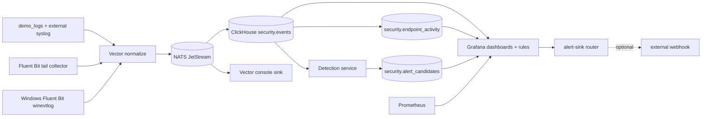

# Architecture

## Whole-system flow

```text
collect -> normalize -> buffer -> store -> detect -> alert -> investigate
```

## Current Local Implementation



## Segments

### Foundation
Core infrastructure:
- ClickHouse
- ClickHouse Keeper
- NATS JetStream
- Grafana
- Prometheus

Open-source options:
- Event store: ClickHouse, TimescaleDB, Apache Druid
- Coordination: ClickHouse Keeper, ZooKeeper
- Message bus: NATS JetStream, Kafka, RabbitMQ
- Dashboards: Grafana
- Metrics: Prometheus, VictoriaMetrics

Recommended:
- ClickHouse
- ClickHouse Keeper
- NATS JetStream
- Grafana
- Prometheus

### Collection
Purpose:
- collect logs from Linux, Windows, apps, and network devices
- forward with minimal buffering and tagging

Options:
- Fluent Bit
- Vector
- OpenTelemetry Collector

Recommended:
- Fluent Bit later for endpoints
- Vector for local MVP

Current local MVP:
- Fluent Bit tails host log files from `data/host-logs`
- Fluent Bit forwards to Vector over `forward` protocol (`24224`)
- Windows collector template defined at `configs/fluent-bit/windows/fluent-bit-windows.conf`

### Ingestion / Normalization
Purpose:
- parse raw input
- normalize into canonical events
- route downstream

Current contract:
- canonical schema version: `hayabusa.event.v1`
- runtime stamp: `security.events.schema_version`
- contract file: `configs/global/event-schema-v1.yaml`

Options:
- Vector
- Logstash
- Fluent Bit

Recommended:
- Vector

### Transport / Buffering
Purpose:
- durable buffering
- replay
- decoupling

Options:
- NATS JetStream
- Kafka
- RabbitMQ

Recommended:
- NATS JetStream

Current local MVP:
- Stream: `HAYABUSA_EVENTS` (subjects `hayabusa.events.>`)
- Durable consumer: `VECTOR_CLICKHOUSE_WRITER`
- Retention guardrail: max bytes `256 MiB`, max age `24h`

### Storage / Query
Purpose:
- durable event storage
- fast analytical queries
- retention and lifecycle

Current local MVP:
- `security.events` stores normalized events
- `security.endpoint_activity` exposes telemetry-derived endpoint last-seen/status inventory

Options:
- ClickHouse
- TimescaleDB
- Apache Druid

Recommended:
- ClickHouse + ClickHouse Keeper

### Detection
Purpose:
- threshold detections
- correlation
- SQL-backed rules
- alert candidates

Options:
- custom Go service
- custom Python service
- custom Rust service

Recommended:
- custom service (MVP in repo)
- YAML rules
- SQL-first detections

### Enrichment
Purpose:
- GeoIP
- threat intel
- asset context
- identity context

Recommended:
- simple local enrichment later

### Alerting
Purpose:
- dedupe
- throttling
- routing
- notification fan-out

Options:
- custom alert router
- Alertmanager
- Grafana Alerting

Recommended:
- Grafana Alerting + local alert router for MVP
- dedicated alert service later for broader delivery controls

### Presentation
Purpose:
- dashboards
- search/hunt views
- triage later

Options:
- Grafana
- React + Go API later
- React + FastAPI later

Recommended:
- Grafana first

### Operations / Observability
Purpose:
- monitor the platform itself
- queue depth
- dropped events
- rule latency
- storage health

Recommended:
- Prometheus + Grafana

### Configuration / Control Plane
Purpose:
- global defaults
- environment overrides
- per-service config
- rule definitions
- endpoint policy source-of-truth and drift checks

Format:
- YAML for human-authored config
- env vars or secrets for sensitive values

Current local MVP:
- Endpoint policy file: `configs/endpoints/windows-endpoints.yaml`
- Drift check command: `./scripts/endpoint-policy-drift-check.sh`
- Policy upsert automation: `./scripts/upsert-endpoint-policy.sh` (enrollment/cutover integrated)
