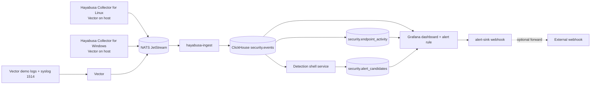

# Architecture

## Goal

```text
ingest -> store -> detect -> alert
```

Hayabusa is intentionally a small local Docker Compose proof-of-function stack.



## Runtime Pieces

- `vector`: accepts demo logs and syslog on the Hayabusa host, normalizes them, and publishes to JetStream
- `collector/linux`: a Linux-side Vector config + shell wrapper that tails SSH auth logs and publishes normalized login events into NATS
- `collector/windows`: a Windows-side Vector config + PowerShell wrapper that reads Security logs and publishes normalized login events into NATS
- `nats` + `nats-init`: provides the `HAYABUSA_EVENTS` stream and `HAYABUSA_INGEST` consumer
- `hayabusa-ingest`: subscribes to `security.events` and writes normalized event envelopes into ClickHouse
- `clickhouse`: stores raw normalized envelopes in `security.events`, exposes flattened auth rows through `security.auth_events`, keeps endpoint visibility in `security.endpoint_activity`, and stores detection output in `security.alert_candidates`
- `api`: exposes minimal `/alerts` and `/events` JSON endpoints backed by ClickHouse
- `web`: serves the demo alerts UI on `http://localhost:3000`
- `detection`: runs one YAML-defined SQL rule every 30 seconds and inserts matches into `security.alert_candidates`
- `grafana`: provides one ClickHouse-backed dashboard and alert rules
- `alert-sink`: receives Grafana webhook payloads and logs them; optional forwarding stays available through env vars

## Non-Goals

- no auth
- no API layer
- no custom frontend
- no clustering or HA
- no endpoint fleet management
- no Windows control plane beyond one real host onboarding path
- no compliance or investigation workflow
