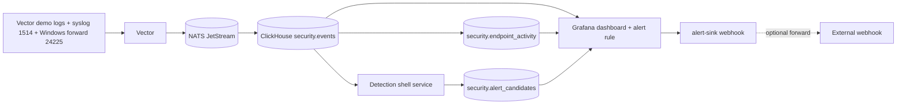

# Architecture

## Goal

```text
ingest -> store -> detect -> alert
```

Hayabusa is intentionally a small local Docker Compose proof-of-function stack.



## Runtime Pieces

- `vector`: accepts demo logs, syslog, and one Windows Fluent Bit forward lane on `24225`, normalizes them, publishes to JetStream, then consumes from JetStream into ClickHouse
- `nats` + `nats-init`: provides the `HAYABUSA_EVENTS` stream and `VECTOR_CLICKHOUSE_WRITER` consumer
- `clickhouse`: stores normalized logs in `security.events`, endpoint visibility in `security.endpoint_activity`, and detection output in `security.alert_candidates`
- `detection`: runs one YAML-defined SQL rule every 30 seconds and inserts matches into `security.alert_candidates`
- `grafana`: provides one ClickHouse-backed dashboard and alert rules
- `alert-sink`: receives Grafana webhook payloads and logs them; optional forwarding stays available through env vars

## Non-Goals

- no auth
- no API layer
- no custom frontend
- no clustering or HA
- no endpoint fleet management
- no Windows control plane beyond one real host onboarding path
- no compliance or investigation workflow
